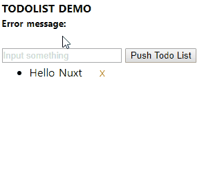

# ssr_with_nuxt

## Quick start

> 这是一个 Nuxt.js 框架的 todolist 应用

> [代码示例](./pages/index.vue)

## Demo



## Build Setup

```bash
# install dependencies
$ npm install

# serve with hot reload at localhost:3000
$ npm run dev

# build for production and launch server
$ npm run build
$ npm start

# generate static project
$ npm run generate
```

For detailed explanation on how things work, checkout [Nuxt.js docs](https://nuxtjs.org).
